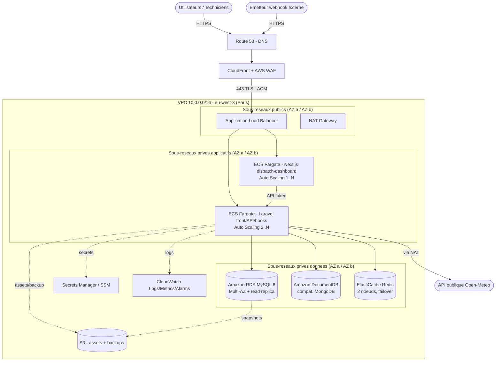

# Architecture cible et choix de l'hebergement

> Competence evaluee : `C29` — Selectionner une plateforme d'hebergement adaptee aux exigences techniques, economiques, qualitatives et reglementaires.

> Contexte : application **OpsTrack Field Service** (gestion d'interventions terrain). L'environnement de qualification et de production fourni est deja heberge sur **AWS, region `eu-west-3` (Paris)**. Ce livrable formalise l'architecture **cible** a viser pour une application **en croissance** ; il n'est pas demande de l'implementer integralement pendant l'epreuve. La mise en service reelle sur machine unique est traitee dans `02_exploitation_securisee.md`.

---

## 1. Analyse des besoins techniques

### 1.1 Composants applicatifs (releves depuis la qualification)

| Composant | Technologie | Role | Contrainte d'hebergement |
| --- | --- | --- | --- |
| Application coeur | Laravel 12 / PHP 8.4 | Front web + API REST `/api/v1` + traitement webhook `hooks.php` | Runtime PHP-FPM 8.4 + serveur web, sans etat (stateless) si sessions/cache externalises |
| Base relationnelle | MySQL 8 | Donnees transactionnelles (users, tickets, interventions, commentaires) | Persistance forte, integrite referentielle, sauvegarde, PITR |
| Base NoSQL | MongoDB | Journaux techniques et evenements applicatifs (`app_events`) | Ecriture en volume, retention/purge, isolable du transactionnel |
| Cache / sessions | Redis | Cache applicatif, sessions, files d'attente | Faible latence, memoire, peut etre volatil mais HA souhaitable |
| Microservice | Next.js 15 (`dispatch-dashboard`) | Tableau de bord superviseur, consomme l'API Laravel | Runtime Node.js 20, service **distinct** et isolable |
| Integration sortante | API publique Open-Meteo | Enrichissement meteo par site | Acces Internet sortant, tolerance a l'indisponibilite |
| Integration entrante | Webhook `hooks.php` | Injection d'evenements externes | Point d'entree public a proteger (auth + filtrage) |

### 1.2 Dependances et flux

- Laravel lit/ecrit MySQL (metier), journalise dans MongoDB, s'appuie sur Redis (cache/sessions/queue).
- Le microservice Next.js appelle l'API Laravel via un token (`OPSTRACK_API_TOKEN`).
- Un appelant externe pousse des evenements sur `hooks.php` (auth HTTP Basic aujourd'hui).
- Laravel appelle l'API publique Open-Meteo en sortie.

### 1.3 Volumetrie et performances estimees (hypotheses de croissance)

| Indicateur | Aujourd'hui (pilote) | Cible 12-18 mois |
| --- | --- | --- |
| Utilisateurs actifs (superviseurs + techniciens) | ~10 | 200 - 500 |
| Tickets / interventions par jour | dizaines | milliers |
| Requetes API (pic) | faible | ~50 - 100 req/s |
| Evenements journalises (MongoDB) | faible | 1 - 5 M docs/mois |
| Disponibilite attendue | best effort | **99,9 %** (< ~8,7 h/an) |
| RPO / RTO cibles | non defini | RPO <= 15 min / RTO <= 1 h |

### 1.4 Besoins non fonctionnels retenus

- **Exposition publique controlee** d'un seul point d'entree HTTPS, le reste en reseau prive.
- **Isolation** entre composants (front/API, microservice, bases, cache).
- **Elasticite** horizontale du compte applicatif (montee en charge journee/soir).
- **Sauvegarde et supervision** natives et automatisees.
- **Conformite RGPD** : donnees personnelles (nom, email, telephone des utilisateurs et contacts clients) hebergees **dans l'UE**.

---

## 2. Architecture cible proposee

### 2.1 Diagramme de deploiement

Architecture **AWS multi-AZ** dans la region `eu-west-3` (Paris). Un seul point d'entree public (ALB + WAF), tout le reste en sous-reseaux prives.

> Repli sans Mermaid : `Internet -> Route53 -> CloudFront/WAF -> ALB (public) -> {ECS Fargate Laravel, ECS Fargate Next.js} (prive) -> {RDS MySQL Multi-AZ, DocumentDB, ElastiCache Redis} (prive isole)`. Secrets Manager, S3 et CloudWatch en services transverses ; sortie Internet des taches via NAT Gateway.

### 2.2 Description des composants

| Composant | Service ou technologie | Dimensionnement | Justification |
| --- | --- | --- | --- |
| Front + API Laravel | ECS Fargate (conteneurs PHP-FPM + Nginx) | 2 taches 0,5 vCPU / 1 Go, auto-scaling 2 -> 6 | Sans serveur a administrer, scaling horizontal automatique, deploiement par image immuable (lien avec le CI/CD) |
| Microservice Next.js | ECS Fargate (Node 20) | 1 tache 0,25 vCPU / 0,5 Go, auto-scaling 1 -> 3 | **Isole** du coeur Laravel, montee en charge independante, panne cloisonnee |
| Base relationnelle | Amazon RDS MySQL 8 | `db.t4g.medium` Multi-AZ + 1 read replica, 50 Go gp3 | Service manage : bascule AZ automatique, sauvegardes + PITR, patchs geres |
| Base NoSQL | Amazon DocumentDB (compatible MongoDB) | 1 instance `t3.medium` (extensible cluster) | Compatible driver Mongo de l'app, manage, dans le VPC ; **variante** MongoDB Atlas (UE) documentee en 3.2 |
| Cache / sessions / files | Amazon ElastiCache for Redis | `cache.t4g.micro`, 2 noeuds (primaire + replica), Multi-AZ | Externalise sessions/cache/queue -> rend Laravel stateless donc scalable ; failover automatique |
| Point d'entree | ALB + ACM + CloudFront + AWS WAF | 1 ALB, certificat ACM, regles WAF managees | TLS termine au bord, un seul point expose, filtrage OWASP (injection, mauvais payloads webhook) |
| DNS | Amazon Route 53 | 1 zone hebergee | Integration native ALB/ACM, health checks, faible cout |
| Secrets | AWS Secrets Manager / SSM Parameter Store | ~6 secrets (`APP_KEY`, DB, Redis, tokens, webhook) | Sort les secrets du `.env`, rotation, acces par role IAM |
| Stockage objet | Amazon S3 | assets, exports, cibles de sauvegarde | Durabilite 11x9, cycle de vie, chiffrement KMS |
| Observabilite | Amazon CloudWatch (+ CloudTrail) | logs, metriques, alarmes, tableaux de bord | Sondes/alertes (lien L04) ; CloudTrail pour la tracabilite/audit |
| Sortie Internet | NAT Gateway | 1 a 2 (HA) | Permet les appels sortants (Open-Meteo) sans exposer les taches |

---

## 3. Choix du fournisseur et des services

### 3.1 Fournisseur retenu

**Amazon Web Services (AWS)**, region **`eu-west-3` (Paris)**.

### 3.2 Justification du choix

- **Continuite avec l'existant** : la qualification et la production fournies sont deja des instances EC2 AWS en `eu-west-3`. Rester sur AWS evite une remigration et capitalise sur les competences/outils deja en place.
- **Souverainete et RGPD** : la region Paris garantit un hebergement **des donnees dans l'UE**. AWS propose un DPA conforme RGPD et des certifications (ISO 27001, SOC, HDS le cas echeant).
- **Services manages couvrant tout le stack** : RDS (MySQL), DocumentDB (MongoDB), ElastiCache (Redis), ECS/Fargate (conteneurs), le tout dans un meme VPC -> **isolation reseau native** et moins d'administration.
- **Elasticite reelle** : auto-scaling Fargate + read replicas RDS pour absorber la croissance sans redimensionnement manuel.
- **Ecosysteme securite/observabilite integre** : IAM, WAF, GuardDuty, CloudWatch, CloudTrail, Secrets Manager, KMS.
- **Chaine CI/CD simple** : build d'image -> ECR -> deploiement ECS, declenchable depuis GitHub Actions (voir `03_deploiement_ci_cd.md`).

**Alternatives ecartees (et pourquoi) :**

| Alternative | Atout | Raison de l'ecarter ici |
| --- | --- | --- |
| Scaleway / OVHcloud (souverain FR) | Souverainete forte, tarifs competitifs | Ecosysteme de services manages (Mongo, Redis, conteneurs auto-scalables) moins complet ; rupture avec l'existant AWS |
| VPS unique auto-gere (Hetzner/DO) | Cout tres bas | Pas d'elasticite ni de HA natives, forte charge d'administration, non aligne avec une cible « croissance » |
| Google Cloud / Azure | Services manages equivalents | Remigration sans valeur ajoutee vs l'existant deja sur AWS |
| **MongoDB Atlas (sur AWS Paris)** | Mongo « natif » manage, sauvegarde incluse | **Retenu comme variante** au lieu de DocumentDB si l'on veut 100 % des fonctionnalites MongoDB ; legerement moins cher (voir 4) |

---

## 4. Estimation des couts

Prix **indicatifs** on-demand, region `eu-west-3`, en €HT/mois (arrondis). Hypothese : architecture cible HA « croissance ». Les **Savings Plans / Reserved Instances** (engagement 1 an) reduiraient le compute et RDS de **~30 a 40 %**.

| Poste de depense | Cout mensuel estime | Cout annuel estime |
| --- | --- | --- |
| ECS Fargate — Laravel front/API (2 taches, auto-scaling) | 45 € | 540 € |
| ECS Fargate — Next.js dispatch-dashboard | 12 € | 144 € |
| RDS MySQL 8 `db.t4g.medium` Multi-AZ + stockage | 120 € | 1 440 € |
| Amazon DocumentDB `t3.medium` (variante Atlas M10 ~55 €) | 60 € | 720 € |
| ElastiCache Redis (2 noeuds, Multi-AZ) | 20 € | 240 € |
| Application Load Balancer | 25 € | 300 € |
| NAT Gateway | 40 € | 480 € |
| CloudFront + AWS WAF | 15 € | 180 € |
| Transfert de donnees sortant | 15 € | 180 € |
| Route 53 (zone + requetes) | 2 € | 24 € |
| S3 (assets + sauvegardes) | 5 € | 60 € |
| CloudWatch + CloudTrail (logs, metriques, alarmes) | 15 € | 180 € |
| Secrets Manager, ECR, snapshots divers | 8 € | 96 € |
| **Total (cible HA, on-demand)** | **~ 382 €** | **~ 4 584 €** |
| **Total optimise (Savings Plans ~ -30 % compute/RDS)** | **~ 300 €** | **~ 3 600 €** |

> **Socle de demarrage economique** (pilote, avant montee en charge) : single-AZ, instances plus petites, 1 NAT, Atlas M10 -> **~ 200 - 250 €/mois (~ 2 400 - 3 000 €/an)**. La bascule vers la cible HA se fait par simple redimensionnement, sans changement d'architecture.

---

## 5. Elasticite et evolutivite

- **Horizontale (prioritaire)** : ECS Fargate + **Service Auto Scaling** sur CPU/memoire et nombre de requetes ALB. Laravel devient **stateless** (sessions/cache/queue dans Redis, fichiers dans S3), donc chaque tache est interchangeable.
- **Microservice decouple** : le `dispatch-dashboard` scale independamment du coeur metier.
- **Lecture base** : **read replicas** RDS pour deporter les lectures (dashboards, listes de tickets) ; DocumentDB/Atlas evolue en ajoutant des instances au cluster.
- **Verticale** : les classes d'instances `t4g`/`t3` se redimensionnent a la hausse sans re-architecture.
- **Pics previsibles** : scaling planifie (heures ouvrees terrain) en complement du scaling reactif.

---

## 6. Disponibilite et continuite de service

- **Multi-AZ** sur tous les etages : ALB reparti sur 2 AZ, taches ECS reparties, RDS Multi-AZ (bascule automatique), ElastiCache avec replica + failover, DocumentDB multi-AZ.
- **Health checks** ALB : une tache defaillante est retiree et remplacee automatiquement.
- **SLA cible 99,9 %** (< ~8,7 h/an) ; les services manages AWS sous-jacents affichent des SLA >= 99,9 %.
- **Sauvegarde / reprise** :
  - RDS : sauvegardes automatiques + **PITR** (RPO <= 15 min), snapshots manuels avant deploiement.
  - DocumentDB/Atlas : snapshots automatiques.
  - S3 : versioning + cycle de vie pour les exports/backups applicatifs.
  - **RTO cible <= 1 h** via restauration snapshot + redeploiement d'image ECS (immuable).
- **Deploiement sans interruption** : rolling update ECS (lien avec le smoke test du L03), rollback par redeploiement de l'image precedente.

---

## 7. Securite et sauvegarde

- **Isolation reseau** : VPC segmente en sous-reseaux **public** (ALB/NAT) / **prives applicatifs** (ECS) / **prives donnees** (RDS, DocumentDB, Redis). Les bases ne sont **jamais** exposees a Internet.
- **Security Groups** en moindre privilege : ALB -> ECS (443/tache), ECS -> RDS (3306), ECS -> DocumentDB (27017), ECS -> Redis (6379) uniquement.
- **Bord** : CloudFront + **WAF** (regles managees OWASP) devant l'ALB pour filtrer injections SQL et payloads webhook mal formes (fait echo aux failles a corriger en L04).
- **Chiffrement** : TLS (ACM) en transit ; **KMS** au repos pour RDS, DocumentDB, ElastiCache, S3, snapshots.
- **Secrets** : `Secrets Manager` / SSM au lieu du `.env` en clair ; injection dans les taches ECS par role IAM ; rotation. `APP_DEBUG=false` en production.
- **IAM** : roles distincts par service, principe du moindre privilege ; pas de cles longues durees dans le code.
- **Audit** : CloudTrail (actions API), GuardDuty (menaces), journaux ALB/WAF vers S3/CloudWatch.
- **Sauvegarde centralisee** : AWS Backup orchestre RDS/DocumentDB/EFS/S3 avec politiques de retention conformes.

---

## 8. Conformite et contraintes reglementaires

- **RGPD / localisation** : donnees personnelles (utilisateurs, contacts clients : nom, email, telephone) hebergees **exclusivement en region UE `eu-west-3` (Paris)**. Aucun transfert hors UE par defaut.
- **Base legale et minimisation** : ne journaliser dans MongoDB que le strict necessaire ; eviter les donnees personnelles dans les logs techniques.
- **Retention** : politiques de purge sur les journaux (`app_events`) et cycles de vie S3/CloudWatch alignes sur la duree de conservation definie.
- **Tracabilite** : CloudTrail (audit infrastructure) + journal applicatif MongoDB (audit metier) ; horodatage et conservation probante.
- **Droits des personnes** : capacite d'export et d'effacement (droit a l'oubli) via l'API/BDD ; documentation des traitements.
- **Contractuel** : DPA AWS conforme RGPD, sous-traitance encadree (art. 28), registre des traitements a tenir cote OpsTrack.
- **Chiffrement et confidentialite** : at-rest (KMS) et in-transit (TLS) sur l'ensemble de la chaine ; acces restreints par IAM et Security Groups.
- **Secteur** : si des donnees de sante venaient a etre traitees, basculer les composants concernes sur une offre **HDS** (Hebergeur de Donnees de Sante) AWS eligible.

---

### Synthese

| Exigence du sujet | Reponse apportee |
| --- | --- |
| Exposition publique des services | Point d'entree unique ALB + CloudFront/WAF, reste en prive |
| Isolation entre composants | VPC segmente (public / app / donnees) + Security Groups moindre privilege |
| Elasticite / capacite d'evolution | Auto-scaling Fargate, read replicas, redimensionnement sans re-architecture |
| Donnees relationnelles et NoSQL | RDS MySQL Multi-AZ + DocumentDB/Atlas (Mongo) manages |
| Securite, sauvegarde, supervision | WAF/IAM/KMS/Secrets Manager + AWS Backup/PITR + CloudWatch/CloudTrail |
| Conformite (protection donnees, tracabilite) | Region UE Paris, RGPD/DPA, chiffrement, retention, audit CloudTrail |
| Cout annuel coherent | ~4 600 €/an on-demand (cible HA), ~3 600 €/an optimise, socle de depart ~2 400-3 000 €/an |
