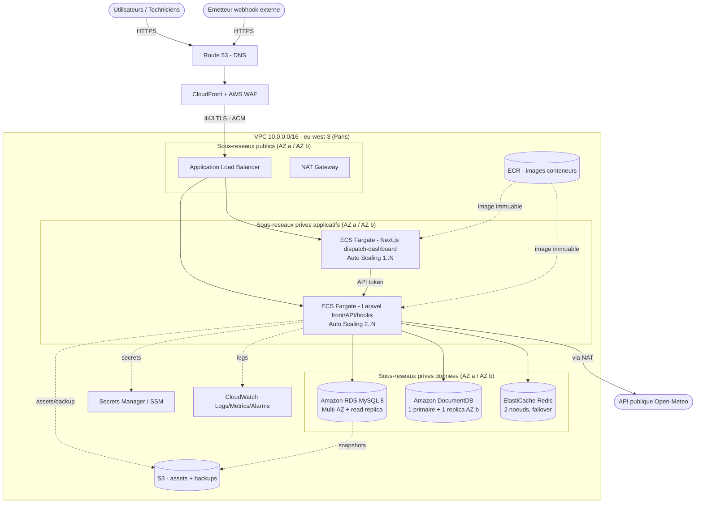

# Architecture cible et choix de l'hébergement

> Compétence évaluée : `C29` — Sélectionner une plateforme d'hébergement adaptée aux exigences techniques, économiques, qualitatives et réglementaires.

> Contexte : application **OpsTrack Field Service** (gestion d'interventions terrain). L'environnement de qualification et de production fourni est déjà hébergé sur **AWS, région `eu-west-3` (Paris)**. Ce livrable formalise l'architecture **cible** à viser pour une application **en croissance** ; il n'est pas demandé de l'implémenter intégralement pendant l'épreuve. La mise en service réelle sur machine unique est traitée dans `02_exploitation_securisee.md`.

---

## 1. Analyse des besoins techniques

### 1.1 Composants applicatifs (relevés depuis la qualification)

| Composant | Technologie | Rôle | Contrainte d'hébergement |
| --- | --- | --- | --- |
| Application cœur | Laravel 12 / PHP 8.4 (contrainte `composer.json` : `php ^8.2`) | Front web + API REST `/api/v1` + traitement webhook `hooks.php` | Runtime PHP-FPM + serveur web, sans état (stateless) **une fois** sessions/cache/queue externalisés (cf. constat § 1.2) |
| Base relationnelle | MySQL 8 | Données transactionnelles (users, tickets, interventions, commentaires) | Persistance forte, intégrité référentielle, sauvegarde, PITR |
| Base NoSQL | MongoDB (`mongodb/laravel-mongodb ^5.6`) | Journaux techniques et événements applicatifs (collection `app_events`) | Écriture en volume, rétention/purge, isolable du transactionnel |
| Cache / sessions / files | Redis | Cache applicatif, sessions, files d'attente — **rôle cible**, non effectif en l'état (cf. constat § 1.2) | Faible latence, mémoire, peut être volatil mais HA souhaitable |
| Microservice | Next.js 15 (`dispatch-dashboard`) | Tableau de bord superviseur, consomme l'API Laravel | Runtime Node.js 20, service **distinct** et isolable, exécution serverless (cf. § 2.2) |
| Intégration sortante | API publique Open-Meteo | Enrichissement météo par site | Accès Internet sortant, tolérance à l'indisponibilité |
| Intégration entrante | Webhook `hooks.php` | Injection d'événements externes | Point d'entrée public à protéger (auth + filtrage) |

### 1.2 Dépendances et flux

- Laravel lit/écrit MySQL (métier) et journalise dans MongoDB (collection `app_events`, modèle `App\Models\Mongo\EventLog`).
- Le microservice Next.js appelle l'API Laravel via un token (`OPSTRACK_API_TOKEN`).
- Un appelant externe pousse des événements sur `hooks.php`, authentifié en **HTTP Basic** aujourd'hui (`WebhookController`, secrets `WEBHOOK_BASIC_USER` / `WEBHOOK_BASIC_PASSWORD`).
- Laravel appelle l'API publique Open-Meteo en sortie (`https://api.open-meteo.com/v1/forecast`, `PublicWeatherService`).

> **Constat relevé sur la qualification — Redis n'est pas encore dans le chemin d'exécution.**
> Dans `.env.example`, `SESSION_DRIVER`, `CACHE_STORE` et `QUEUE_CONNECTION` valent tous les trois `database`, `FILESYSTEM_DISK` vaut `local`, et Redis n'apparaît que dans les stubs de configuration livrés par Laravel (`config/cache.php`, `config/session.php`, `config/queue.php`, `config/database.php`) — aucun appel dans `app/`.
>
> **Conséquence directe pour l'architecture cible** : rendre Laravel **stateless**, qui est le prérequis de tout auto-scaling horizontal, impose de **basculer ces trois drivers sur Redis** (ElastiCache) et `FILESYSTEM_DISK` sur S3. Il s'agit donc d'une **action de migration à planifier avant la montée en charge**, et non d'un simple choix d'hébergement. Elle est sans effet fonctionnel visible et vérifiable en qualification. Tant qu'elle n'est pas faite, l'état applicatif reste dans MySQL, ce qui reporte la charge de session sur la base transactionnelle et interdit le scaling au-delà d'une tâche sans affinité de session.

### 1.3 Volumétrie et performances estimées (hypothèses de croissance)

| Indicateur | Aujourd'hui (pilote) | Cible 12-18 mois |
| --- | --- | --- |
| Utilisateurs actifs (superviseurs + techniciens) | ~10 | 200 - 500 |
| Tickets / interventions par jour | dizaines | milliers |
| Requêtes API (pic) | faible | ~50 - 100 req/s |
| Événements journalisés (MongoDB) | faible | 1 - 5 M docs/mois |
| Disponibilité attendue | best effort | **99,9 %** (< ~8,7 h/an) |
| RPO / RTO cibles | non défini | RPO <= 15 min / RTO <= 1 h |

### 1.4 Besoins non fonctionnels retenus

- **Exposition publique contrôlée** d'un seul point d'entrée HTTPS, le reste en réseau privé.
- **Isolation** entre composants (front/API, microservice, bases, cache).
- **Élasticité** horizontale du compte applicatif (montée en charge journée/soir).
- **Sauvegarde et supervision** natives et automatisées.
- **Conformité RGPD** : données personnelles (nom, email, téléphone des utilisateurs et contacts clients) hébergées **dans l'UE**.

---

## 2. Architecture cible proposée

### 2.1 Diagramme de déploiement

Architecture **AWS multi-AZ** dans la région `eu-west-3` (Paris). Un seul point d'entrée public (ALB + WAF), tout le reste en sous-réseaux privés.

> Repli sans Mermaid : `Internet -> Route53 -> CloudFront/WAF -> ALB (public) -> {ECS Fargate Laravel, ECS Fargate Next.js} (privé) -> {RDS MySQL Multi-AZ, DocumentDB, ElastiCache Redis} (privé isolé)`. Secrets Manager, ECR, S3 et CloudWatch en services transverses ; sortie Internet des tâches via NAT Gateway.

### 2.2 Description des composants

| Composant | Service ou technologie | Dimensionnement | Justification |
| --- | --- | --- | --- |
| Front + API Laravel | ECS Fargate (conteneurs PHP-FPM + Nginx) | 2 tâches 0,5 vCPU / 1 Go, auto-scaling 2 -> 6 | Aucun serveur à administrer, scaling horizontal automatique, déploiement par image immuable (lien avec le CI/CD) |
| Microservice Next.js | ECS Fargate (Node 20) | 1 tâche 0,25 vCPU / 0,5 Go, auto-scaling 1 -> 3 | **Isolé** du cœur Laravel, montée en charge indépendante, panne cloisonnée, exécution **serverless** (voir note ci-dessous) |
| Base relationnelle | Amazon RDS MySQL 8 | `db.t4g.medium` Multi-AZ + 1 read replica, 50 Go gp3 | Service managé : bascule AZ automatique, sauvegardes + PITR, correctifs gérés |
| Base NoSQL | Amazon DocumentDB (compatible protocole MongoDB) | **Cluster 1 primaire `t3.medium` + 1 réplica `t3.medium` en AZ b** | Managé, dans le VPC, bascule automatique sur le réplica ; **compatibilité à valider** et **variante** MongoDB Atlas (UE) documentée en 3.2 |
| Cache / sessions / files | Amazon ElastiCache for Redis | `cache.t4g.micro`, 2 nœuds (primaire + réplica), Multi-AZ | Externalise sessions/cache/queue -> rend Laravel stateless donc scalable ; failover automatique. **Prérequis : migration des drivers décrite en § 1.2** |
| Point d'entrée | ALB + ACM + CloudFront + AWS WAF | 1 ALB, certificat ACM, règles WAF managées | TLS terminé au bord, un seul point exposé, filtrage OWASP (injection, mauvais payloads webhook) |
| DNS | Amazon Route 53 | 1 zone hébergée | Intégration native ALB/ACM, health checks, faible coût |
| Secrets | AWS Secrets Manager / SSM Parameter Store | ~6 secrets (`APP_KEY`, DB, Redis, tokens, webhook) | Sort les secrets du `.env`, rotation, accès par rôle IAM |
| Images conteneurs | Amazon ECR | 2 dépôts (Laravel, Next.js), scan de vulnérabilités activé | Registre privé dans le compte, images immuables taguées par commit (lien `03_deploiement_ci_cd.md`) |
| Stockage objet | Amazon S3 | assets, exports, cibles de sauvegarde | Durabilité 11x9, cycle de vie, chiffrement KMS |
| Observabilité | Amazon CloudWatch (+ CloudTrail) | logs, métriques, alarmes, tableaux de bord | Sondes/alertes (lien `04_supervision_maintien.md`) ; CloudTrail pour la traçabilité/audit |
| Sortie Internet | NAT Gateway | 1 à 2 (HA) | Permet les appels sortants (Open-Meteo) sans exposer les tâches |

> **Note — le micro-service reste bien « serverless ».** Le sujet décrit `dispatch-dashboard` comme un micro-service serverless. **AWS Fargate est un mode d'exécution serverless de conteneurs** : aucune instance EC2 à provisionner, patcher ou dimensionner, facturation à la tâche et à la seconde. Le modèle *function-as-a-service* (AWS Lambda derrière API Gateway, ou hébergement Vercel) a été **écarté** pour trois raisons : le rendu SSR de Next.js 15 y perd le contrôle réseau fin du VPC, l'appel privé à l'API Laravel devrait alors ressortir sur Internet public, et l'unification du build et du déploiement (une seule image OCI par service, un seul pipeline ECR -> ECS) simplifie la chaîne CI/CD et la reproductibilité.

---

## 3. Choix du fournisseur et des services

### 3.1 Fournisseur retenu

**Amazon Web Services (AWS)**, région **`eu-west-3` (Paris)**.

### 3.2 Justification du choix

- **Continuité avec l'existant** : la qualification et la production fournies sont déjà des instances EC2 AWS en `eu-west-3` (adresses IPv4 publiques dans les plages `eu-west-3`). Rester sur AWS évite une remigration et capitalise sur les compétences et outils déjà en place.
- **Souveraineté et RGPD** : la région Paris garantit un hébergement **des données dans l'UE**. AWS propose un DPA conforme RGPD et des certifications (ISO 27001, SOC, HDS le cas échéant).
- **Services managés couvrant tout le stack** : RDS (MySQL), DocumentDB (MongoDB), ElastiCache (Redis), ECS/Fargate (conteneurs), le tout dans un même VPC -> **isolation réseau native** et moins d'administration.
- **Élasticité réelle** : auto-scaling Fargate + read replicas RDS pour absorber la croissance sans redimensionnement manuel.
- **Écosystème sécurité et observabilité intégré** : IAM, WAF, GuardDuty, CloudWatch, CloudTrail, Secrets Manager, KMS.
- **Chaîne CI/CD simple** : build d'image -> ECR -> déploiement ECS, déclenchable depuis GitHub Actions (voir `03_deploiement_ci_cd.md`).

**Alternatives écartées (et pourquoi) :**

| Alternative | Atout | Raison de l'écarter ici |
| --- | --- | --- |
| Scaleway / OVHcloud (souverain FR) | Souveraineté forte, tarifs compétitifs | Écosystème de services managés (Mongo, Redis, conteneurs auto-scalables) moins complet ; rupture avec l'existant AWS |
| VPS unique auto-géré (Hetzner/DO) | Coût très bas | Pas d'élasticité ni de HA natives, forte charge d'administration, non aligné avec une cible « croissance » |
| Google Cloud / Azure | Services managés équivalents | Remigration sans valeur ajoutée vs l'existant déjà sur AWS |
| AWS Lambda / Vercel pour le micro-service | Facturation à l'invocation, zéro socle à administrer | Perte du contrôle réseau VPC pour le SSR Next.js 15 et sortie sur Internet public pour joindre l'API Laravel (voir note § 2.2) |
| **MongoDB Atlas (sur AWS Paris)** | Mongo **natif** managé, sauvegarde incluse, 100 % des opérateurs et de l'agrégation | **Retenu comme variante** si la validation de compatibilité DocumentDB échoue (voir ci-dessous) ; également moins cher à ce dimensionnement |

**Point de vigilance sur DocumentDB — compatibilité à valider avant engagement.** L'application utilise le paquet `mongodb/laravel-mongodb ^5.6`. Amazon DocumentDB est **compatible protocole** MongoDB mais ne couvre que **partiellement l'API MongoDB 5.0** : certains opérateurs d'agrégation, index et commandes ne sont pas implémentés. Le choix est donc conditionnel et se tranche par un test peu coûteux :

1. rejouer en qualification les écritures et lectures de `EventLog` (collection `app_events`) contre un cluster DocumentDB de test ;
2. si tous les opérateurs utilisés par `laravel-mongodb` passent -> **DocumentDB** (donnée dans le VPC, un seul fournisseur, IAM et KMS natifs) ;
3. sinon -> **MongoDB Atlas M10 en région AWS Paris** (PrivateLink vers le VPC), qui reste dans l'UE et conserve la conformité RGPD.

Cette validation évite le risque d'un choix d'hébergement bloquant découvert en production.

---

## 4. Estimation des coûts

Prix **indicatifs** on-demand, région `eu-west-3`, en €HT/mois (arrondis). Hypothèse : architecture cible HA « croissance ». Les **Savings Plans / Reserved Instances / Reserved Nodes** (engagement 1 an) réduisent le compute, RDS, DocumentDB et ElastiCache de **~30 à 40 %**.

| Poste de dépense | Coût mensuel estimé | Coût annuel estimé |
| --- | --- | --- |
| ECS Fargate — Laravel front/API (2 tâches, auto-scaling) | 45 € | 540 € |
| ECS Fargate — Next.js dispatch-dashboard | 12 € | 144 € |
| RDS MySQL 8 `db.t4g.medium` Multi-AZ + stockage | 120 € | 1 440 € |
| Amazon DocumentDB — cluster 1 primaire + 1 réplica `t3.medium` (variante Atlas M10 ~55 €) | 120 € | 1 440 € |
| ElastiCache Redis (2 nœuds, Multi-AZ) | 20 € | 240 € |
| Application Load Balancer | 25 € | 300 € |
| NAT Gateway | 40 € | 480 € |
| CloudFront + AWS WAF | 15 € | 180 € |
| Transfert de données sortant | 15 € | 180 € |
| Route 53 (zone + requêtes) | 2 € | 24 € |
| S3 (assets + sauvegardes) | 5 € | 60 € |
| CloudWatch + CloudTrail (logs, métriques, alarmes) | 15 € | 180 € |
| Secrets Manager, ECR, snapshots divers | 8 € | 96 € |
| **Total (cible HA, on-demand)** | **~ 442 €** | **~ 5 304 €** |
| **Total optimisé** — engagement 1 an sur Fargate + RDS + DocumentDB + ElastiCache (317 € de postes éligibles, -30 % soit -95 €) | **~ 347 €** | **~ 4 164 €** |

> **Socle de démarrage économique** (pilote, avant montée en charge) : single-AZ, instances plus petites, 1 NAT, **DocumentDB en instance unique ou Atlas M10** -> **~ 200 - 250 €/mois (~ 2 400 - 3 000 €/an)**. La bascule vers la cible HA se fait par **ajout de réplicas et redimensionnement**, sans changement d'architecture : c'est précisément l'écart entre ce socle et la cible HA du tableau ci-dessus (le réplica DocumentDB pèse à lui seul 60 €/mois, le Multi-AZ RDS environ 50 €/mois).

---

## 5. Élasticité et évolutivité

- **Horizontale (prioritaire)** : ECS Fargate + **Service Auto Scaling** sur CPU/mémoire et nombre de requêtes ALB. Laravel devient **stateless** (sessions/cache/queue dans Redis, fichiers dans S3), donc chaque tâche est interchangeable. **Prérequis** : la migration des drivers `database` -> `redis` décrite en § 1.2 ; sans elle, le scaling au-delà d'une tâche exige une affinité de session sur l'ALB, ce qui dégrade l'élasticité.
- **Microservice découplé** : le `dispatch-dashboard` scale indépendamment du cœur métier.
- **Lecture base** : **read replicas** RDS pour déporter les lectures (tableaux de bord, listes de tickets) ; DocumentDB/Atlas évolue en ajoutant des instances de lecture au cluster — le réplica de la cible HA sert déjà de nœud de lecture.
- **Verticale** : les classes d'instances `t4g`/`t3` se redimensionnent à la hausse sans re-architecture.
- **Pics prévisibles** : scaling planifié (heures ouvrées terrain) en complément du scaling réactif.

---

## 6. Disponibilité et continuité de service

- **Multi-AZ sur tous les étages** : ALB réparti sur 2 AZ, tâches ECS réparties, RDS Multi-AZ (bascule automatique), ElastiCache avec réplica + failover, **DocumentDB en cluster 1 primaire + 1 réplica dans une AZ distincte** (bascule automatique). Aucun étage de la chaîne ne repose sur une instance unique : c'est la condition pour que la cible **99,9 %** soit tenable, et c'est ce qui distingue la cible HA du socle de démarrage décrit en § 4.
- **Health checks** ALB : une tâche défaillante est retirée et remplacée automatiquement.
- **SLA cible 99,9 %** (< ~8,7 h/an) ; les services managés AWS sous-jacents affichent des SLA >= 99,9 %.
- **Sauvegarde et reprise** :
  - RDS : sauvegardes automatiques + **PITR** (RPO <= 15 min), snapshots manuels avant déploiement.
  - DocumentDB/Atlas : snapshots automatiques quotidiens + PITR (rétention 7 jours).
  - S3 : versioning + cycle de vie pour les exports et sauvegardes applicatives.
  - **RTO cible <= 1 h** via restauration snapshot + redéploiement d'image ECS (immuable).
- **Déploiement sans interruption** : rolling update ECS (lien avec le smoke test de `03_deploiement_ci_cd.md`), rollback par redéploiement de l'image précédente depuis ECR.

---

## 7. Sécurité et sauvegarde

- **Isolation réseau** : VPC segmenté en sous-réseaux **public** (ALB/NAT) / **privés applicatifs** (ECS) / **privés données** (RDS, DocumentDB, Redis). Les bases ne sont **jamais** exposées à Internet.
- **Security Groups** en moindre privilège : ALB -> ECS (port de la tâche), ECS -> RDS (3306), ECS -> DocumentDB (27017), ECS -> Redis (6379) uniquement.
- **Bord** : CloudFront + **WAF** (règles managées OWASP) devant l'ALB pour filtrer injections SQL et payloads webhook mal formés (fait écho aux failles traitées dans `04_supervision_maintien.md`).
- **Renforcement du webhook** : `hooks.php` est aujourd'hui protégé en **HTTP Basic** avec des identifiants par défaut dans `.env.example` (`user` / `password`). Cible : secret fort en Secrets Manager, signature HMAC du payload, restriction d'IP source au niveau WAF et limitation de débit.
- **Chiffrement** : TLS (ACM) en transit ; **KMS** au repos pour RDS, DocumentDB, ElastiCache, S3 et les snapshots.
- **Secrets** : `Secrets Manager` / SSM au lieu du `.env` en clair ; injection dans les tâches ECS par rôle IAM ; rotation. `APP_DEBUG=false` en production.
- **IAM** : rôles distincts par service, principe du moindre privilège ; pas de clés longue durée dans le code.
- **Audit** : CloudTrail (actions API), GuardDuty (menaces), journaux ALB/WAF vers S3/CloudWatch.
- **Sauvegarde centralisée** : AWS Backup orchestre RDS, DocumentDB et S3 avec des politiques de rétention conformes.

---

## 8. Conformité et contraintes réglementaires

- **RGPD et localisation** : données personnelles (utilisateurs, contacts clients : nom, email, téléphone) hébergées **exclusivement en région UE `eu-west-3` (Paris)**. Aucun transfert hors UE par défaut — y compris pour la variante MongoDB Atlas, qui doit être provisionnée en région AWS Paris.
- **Base légale et minimisation** : ne journaliser dans MongoDB que le strict nécessaire ; éviter les données personnelles dans les logs techniques.
- **Rétention** : politiques de purge sur les journaux (`app_events`) et cycles de vie S3/CloudWatch alignés sur la durée de conservation définie.
- **Traçabilité** : CloudTrail (audit infrastructure) + journal applicatif MongoDB (audit métier) ; horodatage et conservation probante.
- **Droits des personnes** : capacité d'export et d'effacement (droit à l'oubli) via l'API et la base ; documentation des traitements.
- **Contractuel** : DPA AWS conforme RGPD, sous-traitance encadrée (art. 28), registre des traitements à tenir côté OpsTrack.
- **Chiffrement et confidentialité** : at-rest (KMS) et in-transit (TLS) sur l'ensemble de la chaîne ; accès restreints par IAM et Security Groups.
- **Secteur** : si des données de santé venaient à être traitées, basculer les composants concernés sur une offre **HDS** (Hébergeur de Données de Santé) AWS éligible.

---

### Synthèse

| Exigence du sujet | Réponse apportée |
| --- | --- |
| Exposition publique des services | Point d'entrée unique ALB + CloudFront/WAF, reste en privé |
| Isolation entre composants | VPC segmenté (public / app / données) + Security Groups moindre privilège |
| Élasticité / capacité d'évolution | Auto-scaling Fargate, read replicas, redimensionnement sans re-architecture — sous réserve de la migration Redis identifiée en § 1.2 |
| Micro-service serverless | Next.js sur ECS Fargate (conteneurs serverless, aucune instance à administrer) ; FaaS écarté et justifié § 2.2 |
| Données relationnelles et NoSQL | RDS MySQL Multi-AZ + DocumentDB en cluster répliqué, variante Atlas si la compatibilité `laravel-mongodb` n'est pas validée |
| Sécurité, sauvegarde, supervision | WAF/IAM/KMS/Secrets Manager + AWS Backup/PITR + CloudWatch/CloudTrail |
| Conformité (protection des données, traçabilité) | Région UE Paris, RGPD/DPA, chiffrement, rétention, audit CloudTrail |
| Coût annuel cohérent | ~5 300 €/an on-demand (cible HA), ~4 200 €/an avec engagement 1 an, socle de départ ~2 400-3 000 €/an |
