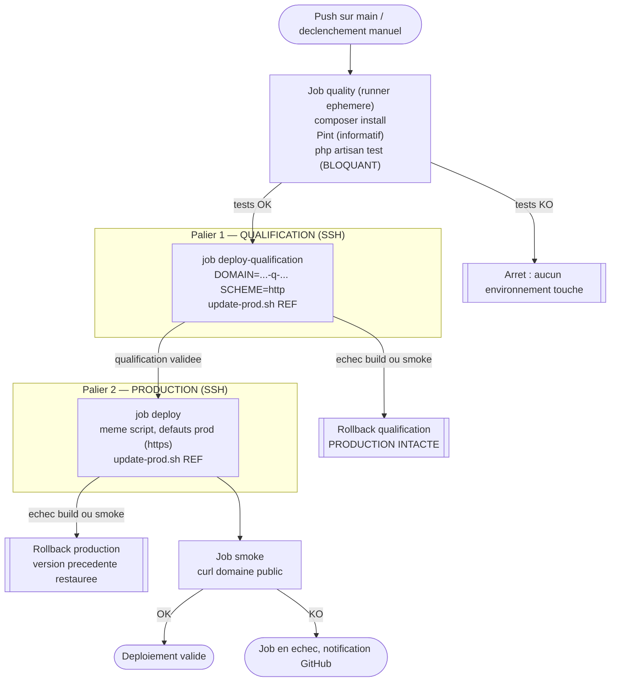

# Deploiement automatise

> Competence evaluee : `C31` — Mettre en oeuvre un systeme de deploiement automatise respectant les bonnes pratiques DevOps.

> Dispositif : pipeline **GitHub Actions** ([`.github/workflows/deploy.yml`](../.github/workflows/deploy.yml)) enchainant controle qualite -> deploiement SSH -> smoke test, appuye sur un script de mise a jour idempotent avec rollback automatique ([`deploy/update-prod.sh`](../deploy/update-prod.sh)).

---

## 1. Strategie de deploiement

### 1.1 Vue d'ensemble

Le code source est heberge sur GitHub : **GitHub Actions** est retenu comme orchestrateur (aucun serveur CI a administrer). Le flux promeut le code **qualification -> production** en quatre etapes strictement ordonnees, chacune bloquant la suivante :

1. **Controle qualite** sur un runner ephemere (tests bloquants) : rien ne part vers un environnement si les tests echouent.
2. **Deploiement sur la QUALIFICATION** via SSH : la reference est installee et verifiee sur `eval-dfs-q-tpl-20265-07.it-students.fr`.
3. **Deploiement en PRODUCTION** via SSH, **uniquement si la qualification a valide la meme reference**.
4. **Smoke test** post-deploiement independant, contre le domaine public de production.

**La production n'est jamais la premiere cible** : c'est le palier 2 qui fait de ce dispositif une promotion inter-environnements et non un simple deploiement direct. Les deux paliers executent **le meme script** `update-prod.sh`, parametre par `DOMAIN` et `SCHEME` — la procedure appliquee a la production est donc, par construction, exactement celle qui a ete validee sur la qualification. La qualification n'ayant pas de TLS, elle est appelee avec `SCHEME=http`.

La branche `main` est la branche **de production** : tout ce qui y est fusionne est deployable. Le declenchement peut aussi etre manuel et cible (input `ref`).

### 1.2 Diagramme du pipeline



> Le meme `update-prod.sh` est joue aux deux paliers ; seules les variables `DOMAIN` et `SCHEME` changent. A chaque palier, un echec de **construction** comme de **smoke test** declenche le rollback de cet environnement et interrompt la chaine.

---

## 2. Outillage retenu

| Outil | Role dans le pipeline | Justification |
| --- | --- | --- |
| **GitHub Actions** | Orchestrateur CI/CD | Natif au depot GitHub, pas d'infra a maintenir, secrets chiffres integres |
| `shivammathur/setup-php@v2` | Prepare PHP 8.4 + extensions sur le runner | Environnement de test aligne sur la production |
| **Composer** / `php artisan test` | Installation + tests (PHPUnit) | Controle qualite fonctionnel, gate bloquante |
| **Laravel Pint** | Verification du style de code | Bonne pratique DevOps, execute en mode informatif |
| `appleboy/ssh-action@v1.2.0` | Execution du deploiement par SSH | Standard, simple, supporte cle privee en secret |
| **`update-prod.sh`** (bash) | Mise a jour idempotente + rollback | Reproductible, rejouable a la main hors pipeline |
| **`curl`** | Smoke test | Verification legere et fiable des endpoints publics |

---

## 3. Declenchement du deploiement

### 3.1 Mode de declenchement

- **Explicite / manuel** : `workflow_dispatch` avec un parametre `ref` (branche ou tag a deployer) — declenchement maitrise depuis l'onglet Actions.
- **Continu** : `push` sur `main` — tout merge valide en production apres passage de la gate qualite.
- Un verrou `concurrency: production-deploy` empeche deux deploiements simultanes.

### 3.2 Reproductibilite

- Runner **ephemere** et version PHP **epinglee** (8.4) : environnement identique a chaque execution.
- `update-prod.sh` est **idempotent** (relançable sans effet de bord) et deploie un `ref` explicite via `git reset --hard`, garantissant un etat de production deterministe.
- Le meme script peut etre lance **manuellement** en SSH, ce qui rend le deploiement independant de GitHub en cas de besoin.

---

## 4. Controles prealables au deploiement

| Controle | Description | Critere de passage |
| --- | --- | --- |
| Installation dependances | `composer install` sur le runner | Succes (dependances resolues) |
| Style de code | `vendor/bin/pint --test` | Informatif (non bloquant) |
| Tests automatises | `php artisan test` (PHPUnit, SQLite en memoire) | **Bloquant** : 100 % des tests au vert |

Preuve du controle qualite (execute sur l'environnement) :

```
PASS  Tests\Unit\ExampleTest
✓ that true is true
PASS  Tests\Feature\ExampleTest
✓ the application returns a successful response
✓ the health endpoint returns ok
✓ the ticket api requires a valid token
Tests: 4 passed (6 assertions)
```

---

## 5. Mise a jour de la production

Etapes executees par `update-prod.sh` (sur la machine de production, appelees par le job `deploy`) :

1. Memorisation du commit courant (`PREV_SHA`) pour un rollback eventuel.
2. `git fetch` + `git reset --hard origin/<ref>` : la production passe exactement sur le `ref` demande.
3. `composer install --no-dev --optimize-autoloader` (`--ignore-platform-req=ext-mongodb`, cf. livrable 02).
4. `php artisan migrate --force` : application des migrations en attente.
5. `php artisan config:clear` : rechargement de la configuration.
6. Reconstruction du microservice Next.js (`npm install && npm run build`) et redemarrage (`systemctl restart`).
7. `systemctl reload apache2`.
8. Smoke test interne (attente active) + **rollback automatique si la construction OU le smoke test echoue** (cf. § 7).

Le meme script sert les deux paliers, la cible etant choisie par variables d'environnement :

```bash
# palier 1 — qualification (pas de TLS)
DOMAIN=eval-dfs-q-tpl-20265-07.it-students.fr SCHEME=http \
  bash /var/www/opstrack/deploy/update-prod.sh main

# palier 2 — production (valeurs par defaut du script)
bash /var/www/opstrack/deploy/update-prod.sh main
```

C'est ce qui garantit que la procedure appliquee a la production est **exactement** celle validee sur la qualification, et non une variante.

---

## 6. Verification post-deploiement

### 6.1 Smoke tests

Le smoke test utilise une **attente active** (jusqu'a 10 tentatives / 30 s) car le microservice Next.js met quelques secondes a ecouter apres un redemarrage.

| Test | Commande ou methode | Resultat attendu |
| --- | --- | --- |
| Sante de l'API | `curl https://…/api/health` | JSON contenant `"status":"ok"` |
| Front principal | `curl https://…/` | HTTP `200` |
| Microservice | `curl https://…/dispatch-dashboard` | HTTP `200` |

### 6.2 Preuve de deploiement reussi

Execution reelle de `update-prod.sh` sur la production :

```
==> Version courante : e0b07214cfe713794bbc56569be6bb84267403ad
==> Deploiement de   : livrable-02-exploitation
==> Smoke test...
   ...services pas encore prets (tentative 1/10)
==> OK : livrable-02-exploitation (e0b0721) est en production.
```

Verification externe des endpoints apres deploiement :

```
/               -> 200
/api/health     -> 200
/dispatch-dashboard -> 200
```

---

## 7. Conduite a tenir en cas d'echec

| Situation | Comportement du dispositif |
| --- | --- |
| Echec du **controle qualite** (tests KO) | Aucun job de deploiement n'est execute : **les deux environnements restent intacts**. |
| Echec sur la **qualification** (construction ou smoke test) | La qualification est restauree par rollback et le job sort en erreur : le palier production n'est **jamais atteint**. C'est le filet principal du dispositif. |
| Echec de la **construction** en production (`composer`, `migrate`, `npm run build`, `systemctl`) | Chaque etape de `build_release` est gardee par `\|\| return 1` et l'appel est `build_release \|\| rollback "construction"` : le **rollback couvre donc aussi les echecs de construction**, pas seulement ceux du smoke test. |
| Echec du **smoke test** apres deploiement | `update-prod.sh` effectue un **rollback automatique** : `git reset --hard <PREV_SHA>`, reconstruction, redemarrage, puis nouveau smoke test de verification. |
| Echec du **rollback** lui-meme | Le script sort en erreur explicite (`intervention manuelle requise`) ; le job GitHub Actions apparait **en echec** (notification GitHub). |
| Diagnostic | Logs du job Actions + `journalctl -u opstrack-dispatch-dashboard` + `storage/logs/laravel.log` (cf. livrable 04). |

> **Note sur l'implementation du rollback.** `build_release` et `smoke_test` sont appelees en contexte conditionnel (`cmd || rollback`), or bash y **desactive `set -e`**. Sans garde explicite, l'echec de `composer install` n'aurait pas interrompu les etapes suivantes et le rollback n'aurait pas ete declenche. D'ou le `|| return 1` sur chacune des six etapes de construction.

**Limite connue** : le rollback restaure le **code**, pas le **schema** (migrations `forward-only`). Recommandation : snapshot de la base avant `migrate` sur les deploiements a migration lourde, et migrations reversibles.

---

## 8. Scripts et fichiers de configuration

| Fichier | Role |
| --- | --- |
| [`.github/workflows/deploy.yml`](../.github/workflows/deploy.yml) | Pipeline CI/CD (quality -> deploy -> smoke) |
| [`deploy/update-prod.sh`](../deploy/update-prod.sh) | Mise a jour idempotente de la production + rollback automatique |
| [`deploy/provision-prod.sh`](../deploy/provision-prod.sh) | Provisioning initial de la machine (cf. livrable 02) |

### Prerequis a configurer (une fois) dans GitHub

Le run automatique necessite cinq **secrets de depot** (Settings -> Secrets and variables -> Actions), non versionnes :

| Secret | Valeur | Palier |
| --- | --- | --- |
| `QUALIF_HOST` | `eval-dfs-q-tpl-20265-07.it-students.fr` | qualification |
| `QUALIF_USER` | `ubuntu` | qualification |
| `PROD_HOST` | `eval-dfs-p-tpl-20265-07.it-students.fr` | production |
| `PROD_USER` | `ubuntu` | production |
| `SSH_PRIVATE_KEY` | contenu de la cle privee `ubuntu.pem` | les deux |

Les deux jobs sont par ailleurs rattaches a des **environnements GitHub** (`qualification` et `production`), ce qui permet d'exiger une approbation manuelle avant la production si l'equipe le souhaite, sans modifier le workflow.

En l'absence de ces secrets, le dispositif reste utilisable **manuellement** avec le meme script, comme demontre au § 6.2 :

```bash
ssh -i ubuntu.pem ubuntu@eval-dfs-q-tpl-20265-07.it-students.fr \
  'DOMAIN=eval-dfs-q-tpl-20265-07.it-students.fr SCHEME=http bash /var/www/opstrack/deploy/update-prod.sh main'
ssh -i ubuntu.pem ubuntu@eval-dfs-p-tpl-20265-07.it-students.fr \
  'bash /var/www/opstrack/deploy/update-prod.sh main'
```

**Prerequis d'execution** : le script appelle `sudo systemctl` ; il repose donc sur le `sudo` sans mot de passe dont dispose l'utilisateur `ubuntu` sur les AMI Ubuntu AWS (`/etc/sudoers.d/90-cloud-init-users`). Sur un hote sans cette configuration, il faut ajouter une regle `NOPASSWD` limitee aux deux commandes `systemctl` utilisees.
