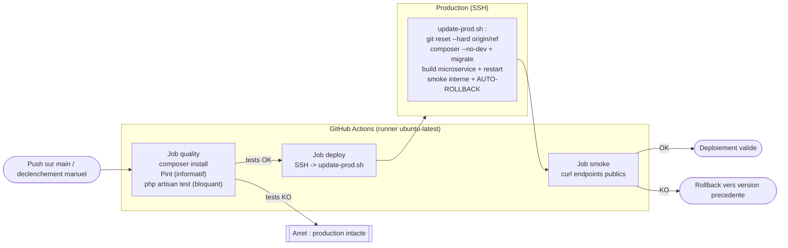

# Deploiement automatise

> Competence evaluee : `C31` — Mettre en oeuvre un systeme de deploiement automatise respectant les bonnes pratiques DevOps.

> Dispositif : pipeline **GitHub Actions** ([`.github/workflows/deploy.yml`](../.github/workflows/deploy.yml)) enchainant controle qualite -> deploiement SSH -> smoke test, appuye sur un script de mise a jour idempotent avec rollback automatique ([`deploy/update-prod.sh`](../deploy/update-prod.sh)).

---

## 1. Strategie de deploiement

### 1.1 Vue d'ensemble

Le code source est heberge sur GitHub : **GitHub Actions** est retenu comme orchestrateur (aucun serveur CI a administrer). Le flux promeut le code **qualification -> production** en trois etapes strictement ordonnees :

1. **Controle qualite** sur un runner ephemere (tests bloquants) : rien ne part en production si les tests echouent.
2. **Deploiement** sur la machine de production via **SSH**, en executant un script idempotent (`update-prod.sh`).
3. **Smoke test** post-deploiement independant, verifiant les points d'entree publics.

La branche `main` est la branche **de production** : tout ce qui y est fusionne est deployable. Le declenchement peut aussi etre manuel et cible (input `ref`).

### 1.2 Diagramme du pipeline



---

## 2. Outillage retenu

| Outil | Role dans le pipeline | Justification |
| --- | --- | --- |
| **GitHub Actions** | Orchestrateur CI/CD | Natif au depot GitHub, pas d'infra a maintenir, secrets chiffres integres |
| `shivammathur/setup-php@v2` | Prepare PHP 8.4 + extensions sur le runner | Environnement de test aligne sur la production |
| **Composer** / `php artisan test` | Installation + tests (PHPUnit) | Controle qualite fonctionnel, gate bloquante |
| **Laravel Pint** | Verification du style de code | Bonne pratique DevOps, execute en mode informatif |
| `appleboy/ssh-action@v1.2.0` | Execution du deploiement par SSH | Standard, simple, supporte cle privee en secret |
| **`update-prod.sh`** (bash) | Mise a jour idempotente + rollback | Reproductible, rejouable a la main hors pipeline |
| **`curl`** | Smoke test | Verification legere et fiable des endpoints publics |

---

## 3. Declenchement du deploiement

### 3.1 Mode de declenchement

- **Explicite / manuel** : `workflow_dispatch` avec un parametre `ref` (branche ou tag a deployer) — declenchement maitrise depuis l'onglet Actions.
- **Continu** : `push` sur `main` — tout merge valide en production apres passage de la gate qualite.
- Un verrou `concurrency: production-deploy` empeche deux deploiements simultanes.

### 3.2 Reproductibilite

- Runner **ephemere** et version PHP **epinglee** (8.4) : environnement identique a chaque execution.
- `update-prod.sh` est **idempotent** (relançable sans effet de bord) et deploie un `ref` explicite via `git reset --hard`, garantissant un etat de production deterministe.
- Le meme script peut etre lance **manuellement** en SSH, ce qui rend le deploiement independant de GitHub en cas de besoin.

---

## 4. Controles prealables au deploiement

| Controle | Description | Critere de passage |
| --- | --- | --- |
| Installation dependances | `composer install` sur le runner | Succes (dependances resolues) |
| Style de code | `vendor/bin/pint --test` | Informatif (non bloquant) |
| Tests automatises | `php artisan test` (PHPUnit, SQLite en memoire) | **Bloquant** : 100 % des tests au vert |

Preuve du controle qualite (execute sur l'environnement) :

```
PASS  Tests\Unit\ExampleTest
✓ that true is true
PASS  Tests\Feature\ExampleTest
✓ the application returns a successful response
✓ the health endpoint returns ok
✓ the ticket api requires a valid token
Tests: 4 passed (6 assertions)
```

---

## 5. Mise a jour de la production

Etapes executees par `update-prod.sh` (sur la machine de production, appelees par le job `deploy`) :

1. Memorisation du commit courant (`PREV_SHA`) pour un rollback eventuel.
2. `git fetch` + `git reset --hard origin/<ref>` : la production passe exactement sur le `ref` demande.
3. `composer install --no-dev --optimize-autoloader` (`--ignore-platform-req=ext-mongodb`, cf. livrable 02).
4. `php artisan migrate --force` : application des migrations en attente.
5. `php artisan config:clear` : rechargement de la configuration.
6. Reconstruction du microservice Next.js (`npm install && npm run build`) et redemarrage (`systemctl restart`).
7. `systemctl reload apache2`.
8. Smoke test interne + **rollback automatique** si echec (cf. § 7).

---

## 6. Verification post-deploiement

### 6.1 Smoke tests

Le smoke test utilise une **attente active** (jusqu'a 10 tentatives / 30 s) car le microservice Next.js met quelques secondes a ecouter apres un redemarrage.

| Test | Commande ou methode | Resultat attendu |
| --- | --- | --- |
| Sante de l'API | `curl https://…/api/health` | JSON contenant `"status":"ok"` |
| Front principal | `curl https://…/` | HTTP `200` |
| Microservice | `curl https://…/dispatch-dashboard` | HTTP `200` |

### 6.2 Preuve de deploiement reussi

Execution reelle de `update-prod.sh` sur la production :

```
==> Version courante : e0b07214cfe713794bbc56569be6bb84267403ad
==> Deploiement de   : livrable-02-exploitation
==> Smoke test...
   ...services pas encore prets (tentative 1/10)
==> OK : livrable-02-exploitation (e0b0721) est en production.
```

Verification externe des endpoints apres deploiement :

```
/               -> 200
/api/health     -> 200
/dispatch-dashboard -> 200
```

---

## 7. Conduite a tenir en cas d'echec

| Situation | Comportement du dispositif |
| --- | --- |
| Echec du **controle qualite** (tests KO) | Le job `deploy` n'est pas execute : **la production reste intacte**. |
| Echec du **smoke test** apres deploiement | `update-prod.sh` effectue un **rollback automatique** : `git reset --hard <PREV_SHA>`, reconstruction, redemarrage, puis nouveau smoke test. |
| Echec du **rollback** | Le script sort en erreur explicite (`intervention manuelle requise`) ; le job GitHub Actions apparait **en echec** (notification GitHub). |
| Diagnostic | Logs du job Actions + `journalctl -u opstrack-dispatch-dashboard` + `storage/logs/laravel.log` (cf. livrable 04). |

**Limite connue** : le rollback restaure le **code**, pas le **schema** (migrations `forward-only`). Recommandation : snapshot de la base avant `migrate` sur les deploiements a migration lourde, et migrations reversibles.

---

## 8. Scripts et fichiers de configuration

| Fichier | Role |
| --- | --- |
| [`.github/workflows/deploy.yml`](../.github/workflows/deploy.yml) | Pipeline CI/CD (quality -> deploy -> smoke) |
| [`deploy/update-prod.sh`](../deploy/update-prod.sh) | Mise a jour idempotente de la production + rollback automatique |
| [`deploy/provision-prod.sh`](../deploy/provision-prod.sh) | Provisioning initial de la machine (cf. livrable 02) |

### Prerequis a configurer (une fois) dans GitHub

Le run automatique necessite trois **secrets de depot** (Settings -> Secrets and variables -> Actions), non versionnes :

| Secret | Valeur |
| --- | --- |
| `PROD_HOST` | `eval-dfs-p-tpl-20265-07.it-students.fr` |
| `PROD_USER` | `ubuntu` |
| `SSH_PRIVATE_KEY` | contenu de la cle privee `ubuntu.pem` |

En l'absence de ces secrets, le dispositif reste utilisable **manuellement** : `ssh … 'bash /var/www/opstrack/deploy/update-prod.sh main'`, comme demontre au § 6.2.
